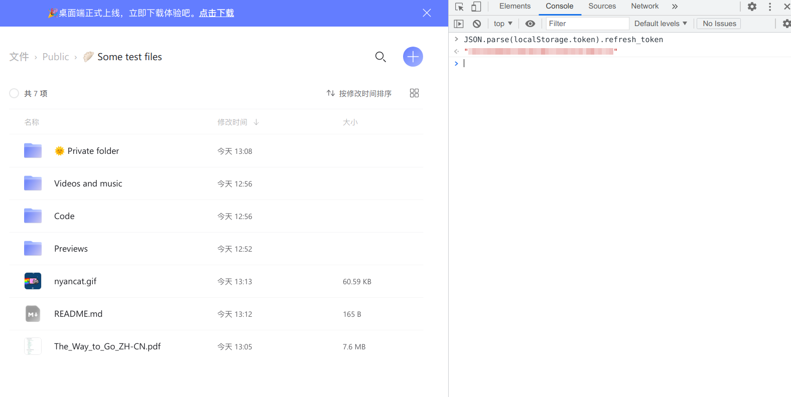

<div align="center">
  <!-- <image src="assets/onedrive-cf-index.png" alt="onedrive-cf-index" width="150px" /> -->
  <h3><a href="https://aliyun.sihuan.workers.dev/">aliyundrive-cf-index</a></h3>
  <em>由 CloudFlare Workers 强力驱动的 AliYunDrive 索引</em>
</div>

---

[](https://aliyun.sihuan.workers.dev/)
[](https://github.com/spencerwooo/onedrive-cf-index/actions?query=workflow%3ADeploy)
<!-- [](./README-CN.md) -->

<h5>本项目使用 CloudFlare Workers 帮助你免费部署与分享你的阿里云盘文件。本项目 fork 自：<a href="https://github.com/spencerwooo/onedrive-cf-index">onedrive-cf-index</a> 并参考了 <a href="https://github.com/Xhofe/alist">alist</a> 的 API， 致敬。</h5>

## Demo

在线演示：[SiHuan's AliYunDrive Index](https://aliyun.sihuan.workers.dev/).


## 功能

### 🚀 功能一览

- 全新「面包屑」导航栏；
- 令牌凭证由 Cloudflare Workers 自动刷新，并保存于（免费的）全局 KV 存储中；
- 使用 [Turbolinks®](https://github.com/turbolinks/turbolinks) 实现路由懒加载；

### 🗃️ 目录索引显示

- 全新支持自定义的设计风格：[spencer.css](themes/spencer.css)；
- 支持使用 Emoji 作为文件夹图标（如果文件夹名称第一位是 Emoji 则自动开启该功能）；
- 渲染 `README.md` 如果当前目录下包含此文件，使用 [github-markdown-css](https://github.com/sindresorhus/github-markdown-css) 渲染样式；
- 支持「分页」，没有一个目录仅限显示 200 个项目的限制了！

### 📁 文件在线预览

- 根据文件类型渲染文件图标，图标使用 [Font Awesome icons](https://fontawesome.com/)；
- 支持预览：
  - 纯文本：`.txt`. [_DEMO_](https://aliyun.sihuan.workers.dev/%F0%9F%A5%9F%20Some%20test%20files/Previews/iso_8859-1.txt).
  - Markdown 格式文本：`.md`, `.mdown`, `.markdown`. [_DEMO_](https://aliyun.sihuan.workers.dev/%F0%9F%A5%9F%20Some%20test%20files/Previews/i_m_a_md.md).
  - 图片（支持 Medium 风格的图片缩放）：`.png`, `.jpg`, and `.gif`. [_DEMO_](https://aliyun.sihuan.workers.dev/%F0%9F%A5%9F%20Some%20test%20files/Previews/sakuya.png).
  - 代码高亮：`.js`, `.py`, `.c`, `.json`... [_DEMO_](https://aliyun.sihuan.workers.dev/%F0%9F%A5%9F%20Some%20test%20files/Code/pathUtil.js).
  - PDF（支持懒加载、加载进度、Chrome 内置 PDF 阅读器）：`.pdf`. [_DEMO_](<https://aliyun.sihuan.workers.dev/%F0%9F%A5%9F%20Some%20test%20files/The_Way_to_Go_ZH-CN.pdf>).
  - 音乐：`.mp3`, `.aac`, `.wav`, `.oga`. [_DEMO_](https://aliyun.sihuan.workers.dev/%F0%9F%A5%9F%20Some%20test%20files/Videos%20and%20music/%E3%80%8E%E3%82%AC%E3%83%BC%E3%83%AB%E3%82%BA%EF%BC%86%E3%83%91%E3%83%B3%E3%83%84%E3%82%A1%E3%83%BC%20%E5%8A%87%E5%A0%B4%E7%89%88%E3%80%8F%E3%82%AA%E3%83%AA%E3%82%B8%E3%83%8A%E3%83%AB%E3%82%B5%E3%82%A6%E3%83%B3%E3%83%89_37_When%20Johnny%20Comes%20Marching%20Home.wav).
  - 视频：`.mp4`, `.flv`, `.webm`, `.m3u8`. [_DEMO_](https://aliyun.sihuan.workers.dev/%F0%9F%A5%9F%20Some%20test%20files/Videos%20and%20music/[VCB-S]Bakemonogatari[01][Hi10p_1080p][BDRip][x264_2flac].mkv).

### 🔒 私有文件夹


我们可以给某个特定的文件夹（目录）上锁，需要认证才能访问。我们可以在 `src/auth/config.js` 文件中将我们想要设为私有文件夹的目录写入 `ENABLE_PATHS` 列表中。我们还可以自定义认证所使用的用户名 `NAME` 以及密码，其中认证密码保存于 `AUTH_PASSWORD` 环境变量中，需要使用 wrangler 来设置这一环境变量：

```bash
wrangler secret put AUTH_PASSWORD
# 在这里输入你自己的认证密码
```

有关 wrangler 的使用细节等详细内容，请参考 [接下来的部分段落](#准备工作)。

### ⬇️ 代理下载文件 / 文件直链访问

- [可选] Proxied download（代理下载文件）：`?proxied` - 经由 CloudFlare Workers 下载文件，如果（1）`config/default.js` 中的 `proxyDownload` 为 `true`，以及（2）使用参数 `?proxied` 请求文件；
- [可选] Raw file download（文件直链访问）：`?raw` - 返回文件直链而不是预览界面；
- 两个参数可以一起使用，即 `?proxied&raw` 和 `?raw&proxied` 均有效。

是的，这也就意味着你可以将这一项目用来搭建「图床」，或者用于搭建静态文件部署服务，比如下面的图片链接：

```
https://aliyun.sihuan.workers.dev/%F0%9F%A5%9F%20Some%20test%20files/nyancat.gif?raw
```

### 🖼️ 任意大小缩略图

- 任意大小的图片缩略图：`?thumbnail=w_160` - `w` 指宽度，另外可选 `h`；`160` 指像素。

```
https://aliyun.sihuan.workers.dev/%F0%9F%A5%9F%20Some%20test%20files/Previews/sakuya.png?thumbnail=w_160
```

### 其他功能

请参考原项目的「🔥 新特性 V1.1」部分：[onedrive-index-cloudflare-worker](https://github.com/heymind/OneDrive-Index-Cloudflare-Worker#-%E6%96%B0%E7%89%B9%E6%80%A7-v11)，**但我不保证全部功能均可用，因为本项目改动部分很大。**

## 部署指南

_不是特别长的中文版部署指南预警！_

### 生成 AliYunDrive API 令牌

1.  登录阿里云盘网页版，按 `F12` 打开开发者工具，找到 `Console` 选项卡，执行 `JSON.parse(localStorage.token).refresh_token` 得到 `refresh_token`

   

2. 同上使用 `JSON.parse(localStorage.token).default_drive_id` 获得 `drive_id`


3. 最后，在我们的阿里云盘中创建一个公共分享文件夹，比如 `/Public` 即可。建议不要直接分享根目录!

最后，~~这么折腾完~~，我们应该成功拿到如下的几个凭证：

- `refresh_token`
- `drive_id`
- `base`：默认为 `/Public`。

_是，我知道很麻烦，但是这是?，大家理解一下。🤷🏼‍♂️_

### 准备工作

Fork 再 clone 或者直接 clone 本仓库，并安装依赖 Node.js、`npm` 以及 `wrangler`。

_强烈建议大家使用 Node version manager 比如 [n](https://github.com/tj/n) 或者 [nvm](https://github.com/nvm-sh/nvm) 安装 Node.js 和 `npm`，这样我们全局安装的 `wrangler` 就可以在我们的用户目录下安装保存配置文件了，也就不会遇到奇奇怪怪的权限问题了。_

```sh
# 安装 CloudFlare Workers 官方编译部署工具
npm i @cloudflare/wrangler -g

# 使用 npm 安装依赖
npm install

# 使用 wrangler 登录 CloudFlare 账户
wrangler login

# 使用这一命令检查自己的登录状态
wrangler whoami
```

打开 <https://dash.cloudflare.com/login> 登录 CloudFlare，选择自己的域名，**再向下滚动一点，我们就能看到右侧栏处我们的 `account_id` 以及 `zone_id` 了。** 同时，在 `Workers` -> `Manage Workers` -> `Create a Worker` 处创建一个 **DRAFT** worker。

修改我们的 [`wrangler.toml`](wrangler.toml)：

- `name`：就是我们刚刚创建的 draft worker 名称，我们的 Worker 默认会发布到这一域名下：`<name>.<worker_subdomain>.workers.dev`；
- `account_id`：我们的 Cloudflare Account ID；
- `zone_id`：我们的 Cloudflare Zone ID。

创建叫做 `BUCKET` 的 Cloudflare Workers KV bucket：

```sh
# 创建 KV bucket
wrangler kv:namespace create "BUCKET"

# ... 或者，创建包括预览功能的 KV bucket
wrangler kv:namespace create "BUCKET" --preview
```

预览功能仅用于本地测试，和页面上的图片预览功能无关。

修改 [`wrangler.toml`](wrangler.toml) 里面的 `kv_namespaces`：

- `kv_namespaces`：我们的 Cloudflare KV namespace，仅需替换 `id` 和（或者）`preview_id` 即可。_如果不需要预览功能，那么移除 `preview_id` 即可。_

修改 [`src/config/default.js`](src/config/default.js)：

- `drive_id`：刚刚获取的 `drive_id`；
- `base`：之前创建的 `base` 目录；

使用 `wrangler` 添加 Cloudflare Workers 环境变量（有关认证密码的介绍请见 [🔒 私有文件夹](#-私有文件夹)）：

```sh
# 添加我们的 refresh_token 和 client_secret
wrangler secret put REFRESH_TOKEN
# ... 并在这里粘贴我们的 refresh_token

wrangler secret put AUTH_PASSWORD
# ... 在这里输入我们自己设置的认证密码
```

### 编译与部署

我们可以使用 `wrangler` 预览部署：

```sh
wrangler preview
```

如果一切顺利，我们即可使用如下命令发布 Cloudflare Worker：

```sh
wrangler publish
```

我们也可以创建一个 GitHub Actions 来在每次 `push` 到 GitHub 仓库时自动发布新的 Worker，详情参考：[main.yml](.github/workflows/main.yml)。

如果想在自己的域名下部署 Cloudflare Worker，请参考：[How to Setup Cloudflare Workers on a Custom Domain](https://www.andressevilla.com/how-to-setup-cloudflare-workers-on-a-custom-domain/)。

## 样式、内容的自定义

- 我们 **应该** 更改默认「着落页面」，直接修改 [src/folderView.js](src/folderView.js#L51-L55) 中 `intro` 的 HTML 即可；
- 我们也 **应该** 更改页面的 header，直接修改 [src/render/htmlWrapper.js](src/render/htmlWrapper.js#L24) 即可；
- 样式 CSS 文件位于 [themes/spencer.css](themes/spencer.css)，可以根据自己需要自定义此文件，同时也需要更新 [src/render/htmlWrapper.js](src/render/htmlWrapper.js#L3) 文件中的 commit HASH；
- 我们还可以自定义 Markdown 渲染 CSS 样式、PrismJS 代码高亮样式，等等等。

---

🏵 **onedrive-cf-index** ©Spencer Woo. Released under the MIT License.

Authored and maintained by Spencer Woo.

[@Portfolio](https://spencerwoo.com/) · [@Blog](https://blog.spencerwoo.com/) · [@GitHub](https://github.com/spencerwooo)
